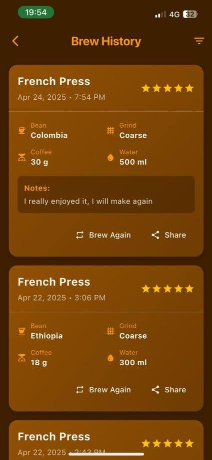
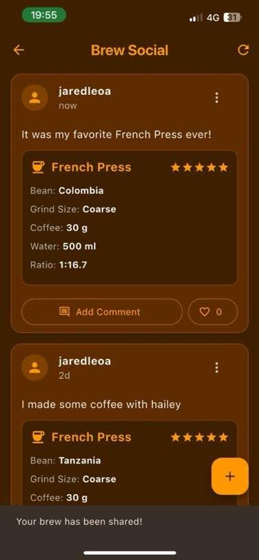

# BrewHand

Full-stack mobile application for managing coffee brews, recipes, and brewing history, with guided workflows, asynchronous timers, and persisted user data.

BrewHand is designed as a stateful, data-driven application that supports end-to-end brewing flows, from method selection and configuration to execution, review, and social sharing.

---

## Features

### My Brews Dashboard
User dashboard aggregating persisted brew data, including usage statistics, streaks, and historical summaries derived from stored brew records.


---

### Brewing Method Selection
Brewing method selection flow driving dynamic configuration paths based on the selected brewing method and difficulty.


---

### Brew Method Parameters
Parameterized brew setup allowing users to configure beans, grind size, ratios, and water volume using data-driven defaults.


---

### Step-by-Step Brew Guide
Sequential brewing guide implementing controlled progression through defined brewing steps.


---

### Brewing Timer (Asynchronous State)
Asynchronous brewing step with countdown timer, pause/reset controls, and persisted state handling across navigation.


---

### Brew Completion & Review
Post-brew completion flow capturing user ratings, notes, and feedback before persisting results to storage.


---

### Brew History
Historical brew records displaying saved parameters, ratings, timestamps, and replay/share functionality.



---

### Brew Social Feed
Social feed displaying shared brew records with metadata, ratings, and interaction hooks.



---

### BrewBot Assistant
Rule-based conversational assistant providing coffee bean and brewing recommendations based on user preferences and inputs.


---

## Architecture Overview

- **Frontend:** Flutter mobile application with modular UI components and asynchronous state handling.
- **Backend:** Supabase for authentication, data persistence, and realtime updates.
- **Data Model:** Relational schema for brews, methods, parameters, ratings, and user activity.
- **State Management:** Step-based workflows with persisted state across screens.
- **Async Logic:** Timers, guided steps, and user-controlled progression.

---

## Tech Stack

- **Frontend:** Flutter, Dart  
- **Backend:** Supabase (PostgreSQL, Auth, Realtime)  
- **Data:** Relational data modeling, persisted user records  
- **Async:** Timers, step-based workflows, realtime updates  

---
## Setup Instructions

### Prerequisites
- Flutter SDK (latest stable version)
- Dart SDK
- Android Studio or Xcode (for mobile deployment)
- Supabase account

### Installation

1. **Clone the repository**
   ```bash
   git clone https://github.com/yourusername/brewhand.git
   cd brewhand
   ```

2. **Install dependencies**
   ```bash
   flutter pub get
   ```

3. **Configure Supabase**
   - Create a new Supabase project
   - Run the SQL scripts in the following order:
     - `supabase_fixed_solution.sql` (complete database setup)
     - Or individual components:
       - Table creation scripts
       - `supabase_functions_fixed.sql`
       - `supabase_rls_policies.sql`
   - Update the Supabase credentials in the app

4. **Run the app**
   ```bash
   flutter run
   ```

## License

This project is licensed under the MIT License - see the LICENSE file for details.
